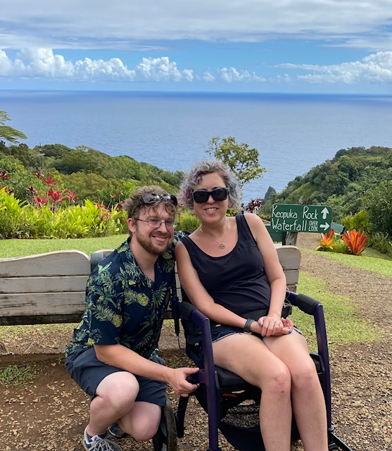

In 2020, my wife Sarah was diagnosed with amyotrophic lateral sclerosis ([ALS](https://en.wikipedia.org/wiki/ALS), also known as Lou Gehrig's disease). Our world was completely rocked by this, but we continue to do our best to live the lives we want and enjoy each other for as long as we can.

If you can, consider giving to any of the following important organizations that have made  huge difference in our lives and those of our other family members affecwted by this disease:

- [Team Gleason](https://teamgleason.org/donate/)
- [Houston Methodist ALS Clinic](https://givingforms.houstonmethodist.org/GeneralGivingForm) (select ALS fund from the dropdown)
- [WashU Neurology](https://millerlab.wustl.edu/donate/)
- [ALS association](https://www.als.org/get-involved/ways-give)

